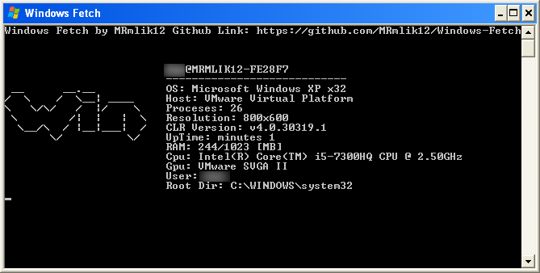

# Windows-Fetch
A neofetch conversion on .NET. Windows Fetch works fine in windows xp, vista, 7, 8, 8.1 and 10. 

| Platform Target | Status |
| --------------- | ------
| AnyCpu | |

## Screenshots

Windows Xp  

Windows 10  

## Requirements
* .NET >= 4.0
* Windows xp & later

## How to configure
If you want configure windows fetch go here https://github.com/MRmlik12/Windows-Fetch/wiki/How-to-configure-Windows-Fetch

## Download
The Windows Fetch builds has moved to SourceForge on this link https://sourceforge.net/projects/windows-fetch/, but 
the source code will be on github!
* Latest Version https://sourceforge.net/projects/windows-fetch/files/latest/download
* All versions https://sourceforge.net/projects/windows-fetch/files/

2019 MRmlik12